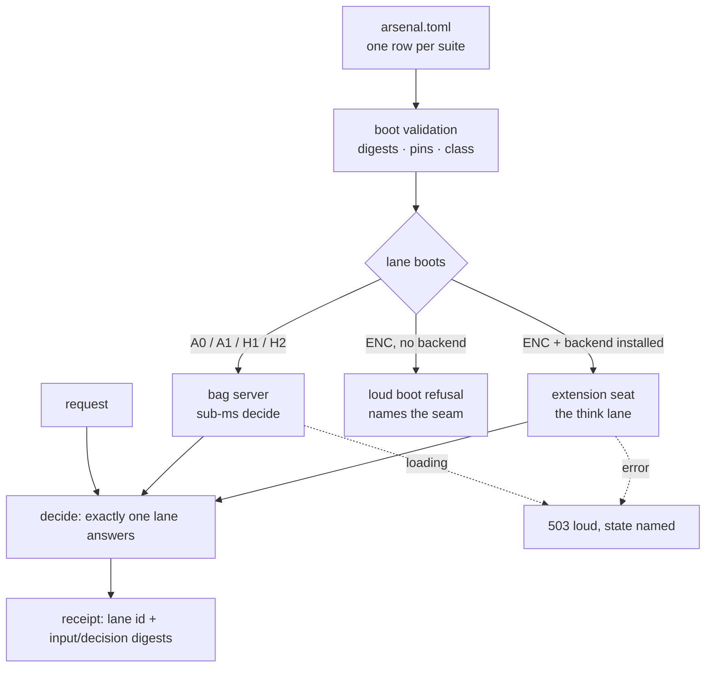

# Serving topology — one lane per suite, and where the think lane plugs in

How a decision is answered: the selection laws, the arm vocabulary, the lane
lifecycle that IS automatic, and the extension seam the private think lane
uses. This page is concept-level by design — measured records live in the
repos that own them.

## The one-sentence model

**One lane per suite, chosen by a validated manifest at boot; nothing routes
per-request.**

A reader arriving from a Mixture-of-Experts background should read this as the
deliberate opposite: there is no gating network, no per-input expert pick, and
no weighted mixing of outputs. The routing "intelligence" was spent OFFLINE —
paired GOAT benches decided which arm each suite serves — and the verdict was
baked into the manifest as data. The runtime is dumb-but-auditable on purpose.

## The selection laws

- **A5 — the manifest is the only selection surface.** Suite → vessel/artifact
  → posture → pins live in `arsenal.toml`; there are no hard-coded match
  tables and no filename conventions. Boot validation refuses drift loud,
  naming row + field.
- **A6 — posture rows are pinned in both media.** The manifest's digest is
  byte-pinned by the serve gates: a TOML edit reds exactly like a code edit.
- **A2 — never blend.** Selection is a monotonic atomic hot-swap of whole
  artifacts. A decision observes one whole server, never a weighted mixture.
- **A3 — cheap routing, no dyn on the decide path.** Per-decision work is
  modelless ns–µs class. Any consult (paying a heavier engine on some cases)
  must be GOAT-justified — the measured refusal precedent is banking77's H1
  consult, which paid accuracy at confidence and was refused.

## The arms

| arm | what answers | shape |
|---|---|---|
| `A0` | the modelless engine | the free floor; a tie sells nothing |
| `A1` | the specialist over the seat | the seated artifact alone |
| `H1` | cascade with top-k prune | gate abstains → prune → specialist over survivors (input-conditional within the suite) |
| `H2` | prior fusion | specialist margin folded into the modelless prior |
| `ENC` | the think-depth lane | served ONLY through the extension seam below; the open build never serves the class |

An ENC row in a build with no lane backend installed refuses **loud at boot**,
naming the install seam — never a silent degrade to a cheaper arm.

## What IS automatic (lane lifecycle)

- **Lazy load** — `budget.load = "lazy"` rows boot `Unloaded`; the first
  decision triggers the load behind the 503 `loading` window. Eager rows are
  byte-identical to the pre-lazy behavior.
- **The hoard gate** — at load/swap time, a candidate suite is judged against
  the loaded set: a near-duplicate corpus (colinearity past the cap) is
  refused, and a rank-collapsed set fails the Vendi certificate. The corpus
  centroid is a signed simhash fold; serving decisions never touch it.
- **Monotonic swap** — `check_epoch_tag` accepts advance or idempotent
  replay; downgrade and fork are refused (force logs loud). Install happens
  whole under the slot lock — no torn reads, no blend, no dyn.
- **Wire eviction** — a release call evicts a lazy lane; the epoch tag is
  kept, so reloading a downgraded artifact still refuses.

## The extension seam

The open grammar carries the `ENC` vocabulary; the execution is a lane
backend. A downstream crate installs its loaders via `install_ext_boots`
BEFORE any boot, and the suite then boots into the extension seat — a
first-class decide-path citizen with the same signature, the same serve edge,
and the same receipts as every other lane.

### The no-fallback law

The decide path returns a typed result — an error propagates as a loud 503
with a machine-readable code. There is **no per-request fallback** from the
think lane to a cheaper arm, by construction. The reason is measurement
honesty: the receipt names the lane that answered. A silent fallback would
serve one engine's answer wearing another's label and corrupt every published
cell.

"Smarter falls back to the cheap flow" therefore happens at **seating time,
not request time**: if the heavier class does not strictly beat the incumbent
at the paired gate, the manifest simply keeps the cheaper arm, and the
heavier lane never boots for that suite.

## Where adaptivity could live

A two-tier escalation INSIDE one seated suite — answer on the cheap leg, and
escalate the hard cases to the think leg behind a worthiness gate with the
tier disclosed in the receipt — is specified in the private lane's design
record (escalation lane proposal, the private moat repo). The measured
caution it carries: a bare "escalate on abstain" transfers badly out of
sample, so per-suite margins, a bounded escalation rate, and a loud
fallback policy are load-bearing parts of that design, not decoration. The
open grammar changes only if that composition passes its GOAT gate — via the
two-repo lockstep the pin law already enforces.
