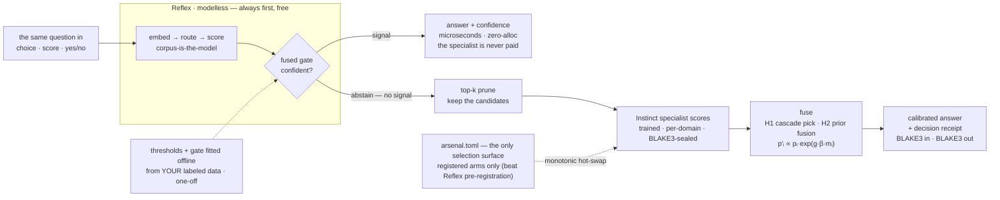

# The Instinct composition flow

How the trained add-on composes with the free engine. One figure, rendered
from the mermaid block below to BOTH mirrors by `reflex-site`'s
`scripts/render_tetris_flows.py` (same palette + postprocess as the Reflex
hero `decision_flow.svg`; `--check` verifies the two mirrors byte-identical):

- `instinct_flow.svg` — beside this doc (the repo's record)
- `reflex-site/assets/instinct_flow.svg` — what `/bench/#instinct` embeds
  (the site is Reflex's; Instinct stays out of its home page until it beats
  every published lane — riir-instinct `.issues/008`, the PoC framing)

The laws the figure carries (full text: the repo root `AGENTS.md` +
`.proposals/001_arsenal_cognition_vessel_protocol.md`):

- **Reflex always answers first, free.** The specialist is paid only where
  Reflex's calibrated fused gate abstains — never as a replacement lane.
- **A2 — never blend.** Selection is a monotonic atomic hot-swap of whole
  artifacts from `arsenal.toml`, the ONE selection surface (A5); a decision
  observes one whole server, never a torn read.
- **Registered arms only.** A specialist joins the manifest solely where it
  beat free Reflex pre-registration, on one frozen test read (the GOAT
  gate, `stats::PairedDiff::lb95`).
- **The receipt.** Every answer carries the decision receipt: build
  fingerprint, BLAKE3(input), BLAKE3(canonical decision), lane id.

