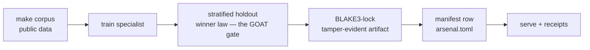

# The Instinct dev build flow

How a specialist gets made and put on duty — the development counterpart
of the [composition figure](../03_decision_flow/instinct_flow.md), which
shows what happens at answer time. One figure:

1. **make corpus** — the training corpus is assembled from public data.
2. **train specialist** — one model per domain, trained on that corpus.
3. **stratified holdout + winner law** — the GOAT gate: the candidate
   earns a row only by strictly beating the free engine on one frozen,
   label-stratified test read.
4. **BLAKE3-lock** — a passing artifact is locked into a tamper-evident,
   checksum-verified artifact; nothing trains at serve time.
5. **manifest row** — the locked winner is registered in `arsenal.toml`,
   the ONE selection surface (the composition figure's hot-swap lane).
6. **serve + receipts** — the lane answers with a decision receipt:
   build fingerprint, BLAKE3(input), BLAKE3(canonical decision), lane id.

